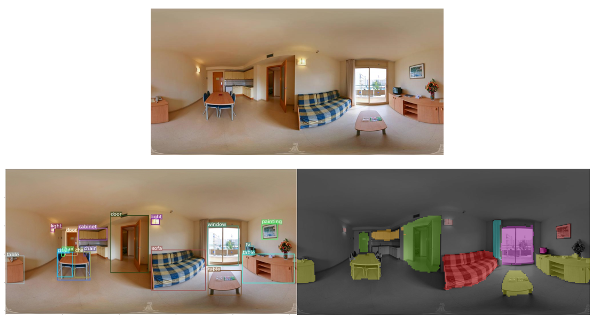

# Panoramic BlitzNet
Tensorflow 2.x implementation of Panoramic BlitzNet for object detection and semantic segmentation on indoor panoramic images.

## Introduction
This repository contains a re-implementation of the [paper](https://ieeexplore.ieee.org/stamp/stamp.jsp?arnumber=9197335): 'What’s in my Room? Object Recognition on Indoor Panoramic Images' by Julia Guerrero-Viu, Clara Fernandez-Labrador, Cédric Demonceaux and José J. Guerrero.
More info can be found in our [project page](https://webdiis.unizar.es/~jguerrer/room_OR/)

Our code is original but it is based on the previous work of Dvornik et al. [BlitzNet](https://arxiv.org/abs/1708.02813) which code can be found in their [webpage](https://github.com/dvornikita/blitznet)

<p align="center">

  </p>

## Use Instructions
We recommend the use of a virtual enviroment for the use of this project. (*e.g.* [anaconda](https://www.anaconda.com/products/individual))
```bash
$ conda new -n envname python=3.8.5 # replace envname with your prefered name
```
### Install Requirements
#### 1. This code has been compiled and tested using:
  - python 3.8.5
  - cuda 10.1
  - cuDNN 7.6
  - TensorFlow 2.3
 
 You are free to try different configurations but we do not ensure it had been tested.
#### 2. Install  python requirements:
  ```bash
  (envname)$ pip install -r requirements.txt
  ```
### Download Dataset
SUN360: [download](https://webdiis.unizar.es/~jguerrer/room_OR/#download-dataset)

Copy the folder 'dataset' to the folder where you have the repository files.

### Download Model
[download](https://drive.google.com/drive/u/2/folders/1qfTHTsm6vrZtRnTGaTbVZjXKWxMhBX53)

Download the folder 'Checkpoints' which includes the model weights and copy it to the folder where you have the repository files.

### Test run
Ensure the folders 'dataset' and 'Checkpoints' are in the same folder than the python files.

To run our demo please run:
```bash
(envname)$ python3 test.py PanoBlitznet # Runs the test examples and saves results in 'Results' folder
```
### Training and evaluation
If you want to train the model changing some parameters and evaluate the results follow the next steps:

#### 1. Create a [TFDS](https://www.tensorflow.org/datasets/api_docs/python/tfds?version=nightly) from SUN360:
Do this  ONLY if it is the first time using this repository.

Ensure the folder 'dataset' is in the same folder than the python files.

Change the line 86 in sun360.py file with your path to the 'dataset' folder.
```bash 
(envname)$ cd /path/to/project/folder
```
```bash
(envname)$ tfds build sun360.py # Creates a TFDS (Tensorflow Datasets) from SUN360
```
#### 2. Train a model:
To train a model change the parameters you want in the config.py file.
You are free to try different configurations but we do not ensure it had been tested.
```
Usage: training_loop.py <experiment_name> <epochs> [--restore_ckpt]

Options:
	-h --help  Show this screen.
	--restore_ckpt  Restore weights from previous training to continue with the training.
```
```bash
(envname)$ python3 training_loop.py Example 10
```
If you want to load a model to train from it (or continue a training) run:
```bash
(envname)$ python3 training_loop.py Example 10 --restore_ckpt
```
Ensure to change in training_loop.py file how the learning rate changes during training to continue your training in a properly way.

#### 3. Evaluate a model:
Loads a saved model and evaluates it.
```bash
(envname)$ python3 evaluation.py Example # Calculates mAP, mIoU, Precision and Recall and saves results in 'Results' folder
```
## Contact
- a.denova.guerrero@gmail.com (Alejandro de Nova Guerrero)
- juliagviu@unizar.es (Julia Guerrero Viu)
- berenguel@unizar.es (Samuel Bruno Berenguel Baeta)
- jguerrer@unizar.es (José Jesús Guerrero Campo)

## License 
This software is under GNU General Public License Version 3 (GPLv3), please see [GNU License](http://www.gnu.org/licenses/gpl.html)

For commercial purposes, please contact the authors.

## Disclaimer
This site and the code provided here are under active development. Even though we try to only release working high quality code, this version might still contain some issues. Please use it with caution.
